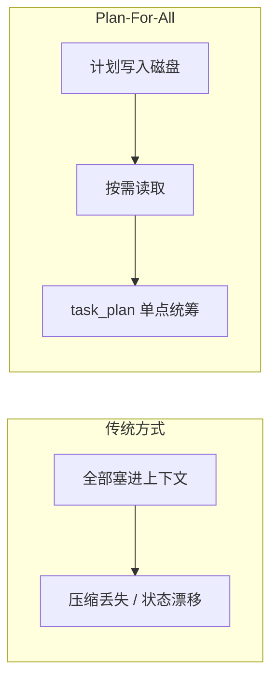
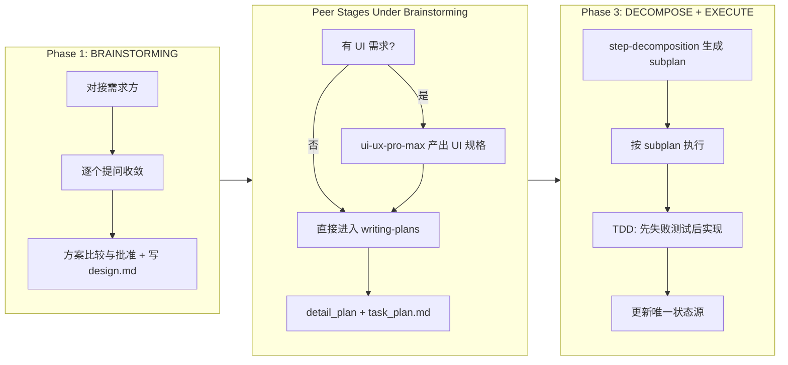

<div align="center">

# Plan-For-All

*像 Manus 一样用文件持久化记忆，像 TDD 一样用小步执行。*

[](https://claude.com/claude-code)
[](LICENSE)
[](https://github.com/obra/superpowers)
[](https://github.com/OthmanAdi/planning-with-files)
[](https://github.com/nextlevelbuilder/ui-ux-pro-max-skill)

> **Claude-Code-Agent-Plugin** | **superpowers (TDD & PM)** | **planning-with-files (Manus Style)** | **ui-ux-pro-max (Frontend Design)** | **MIT License**

</div>

---

<div align="center">

**🌐 Language / 语言**

[**简体中文**](README.md) | [English](README_en.md)

</div>

---

## 痛点

你是否经历过这些崩溃时刻？

| 场景 | 结果 |
|------|------|
| Claude Code Plan Mode 上下文被压缩 | 辛辛苦苦梳理的需求全部丢失，ToDo 永远无法完成 |
| brainstorming + writing-plans 输出一大段计划 | 疯狂冲击上下文，导致计划、状态、验证混在一起，最后谁都不可信 |
| 长任务执行到一半会话中断 | 再次打开时完全不记得做到了哪里，一切从头开始 |
| 项目既有 UI 又有逻辑/存储/协议约束 | 如果没有统一收敛，需求和实现边界会持续互相污染 |

**Plan-For-All** 的核心不是“多写几个文档”，而是把需求收敛、界面细化、技术计划、执行分解与测试执行拆成 agent 可调度的阶段产物：
- `brainstorming` 负责主管式需求收敛与最终设计契约
- `ui-ux-pro-max` 与 `writing-plans` 是同级阶段，由 `brainstorming` 调度（有 UI 时先 UI，后 Writing）
- `step-decomposition` 负责执行视图提取
- `test-driven-development` 负责执行阶段测试优先
- `task_plan.md` 负责唯一状态真源

---

## 核心思想

Plan-For-All 将大段任务拆解成可恢复的小计划，基于 `task_plan.md` 统一跟踪当前状态，让 **计划是最新状态**，让 **上下文只承载当前步骤**。



---

## 工作流程（Agent 调度）



---

## 当前版本原则

| 原则 | 说明 |
|------|------|
| `task_plan.md` 是唯一状态真源 | 状态只在这里更新，`findings.md` / `progress.md` 不得夺权 |
| 先收敛，后计划 | `brainstorming` 先像产品经理一样对接客户，逐个提问、比较方案、收敛整体需求，再写 design doc |
| `brainstorming` 负责整体需求 | 不强行按前端/后端拆思路，一体化项目也先整体收敛 |
| `ui-ux-pro-max` 与 `writing-plans` 同级 | 都由 `brainstorming` 调度；有 UI 需求时先 UI 细化，再进入 writing-plans |
| `writing-plans` 是实现交接 | 服务写代码的人/agent，并吸收 UI 阶段输出的界面约束 |
| 先冒烟，后实现 | 非 trivial 任务必须先定义 smoke check 或 failure reproduction |
| TDD 不能后移 | 不再把 TDD 当成“写完代码后提醒一下”的附属动作 |
| `step_subplan` 是执行视图 | 它提取当前目标、验证和退出条件，不是 detail plan 原文搬运 |
| Hook 保底护栏保留 | hook 继续负责会话恢复、上下文回放、TDD/验证提醒，但不替代正文约束 |
| 新名词默认强制检索 | 新名词、语义漂移术语、近期新范式默认先查；如果会影响下一问、方案比较或设计假设，必须先查再问，优先官方，无官方则限制查近期高质量来源 |
| Audit 全流程持续生效 | brainstorming / planning / subplan / execute / completion 任一阶段出现新风险词都要重新纳入审计 |

---

## `ui-ux-pro-max` 的位置

`ui-ux-pro-max` 与 `writing-plans` 是 `brainstorming` 主管下的同级阶段。

它不负责需求收敛主流程，但在存在 UI 需求时必须先于 `writing-plans` 执行。

只有在下面这类情况下，它才会被 `brainstorming` 调用：
- 已经确认项目存在用户可见界面
- 页面结构、信息层级、交互质量或视觉质量会明显影响成败
- 用户明确要求界面风格、视觉方向、组件布局、设计系统或体验质量

它负责的是：
- 页面结构细化
- 信息层级细化
- 交互与视觉方向细化
- UI 风险与反模式识别

它不负责的是：
- 替代整体需求收敛
- 决定整个项目到底要做什么功能
- 决定是否拆前后端
- 拥有最终 design doc

用完以后，输出会并入 planning 输入，再进入 `writing-plans`。

---

## 使用示例

### 示例一：待办网站（Todo-Web with Login）

**输入：**

```text
我想要一个待办网站，有登录功能。
```

**自动发生的事：**

```text
[plan-for-all] 检测到新项目，进入 Phase 1: BRAINSTORMING
```

```text
Q1: 这个待办网站是给自己用还是给别人用？
  A: 个人使用 / B: 团队协作 / C: 公开访问
```

后续 `brainstorming` 会继续逐个提问，收敛：
- goals
- non-goals
- 用户流程
- 页面/模块
- 功能边界
- 约束与验收标准

如果在整体需求已经收敛后，发现这个项目确实需要专门的界面设计细化，`brainstorming` 才会调用 `ui-ux-pro-max` 补充：
- 信息层级
- 页面结构
- 交互模型
- 设计方向
- UI 风险与反模式

然后由 `brainstorming` 统筹把 UI 输出合并到 planning 输入，再交给 `writing-plans`。

### 示例二：本地 API Proxy / 中转服务

**输入：**

```text
帮我规划一个本地 API proxy，把不同 provider 路由到统一入口。
```

**自动发生的事：**

```text
Phase 1: AI 先核验协议/兼容性等高风险外部事实
     -> 再整体收敛问题定义、协议边界、配置契约、验收标准
     -> 写出 design contract
```

这类项目没有需要专门细化的用户界面，因此：

```text
跳过 ui-ux-pro-max
直接进入 Phase 2: WRITING PLANS
```

### 示例三：一体化本地小项目

**输入：**

```text
我想做一个本地知识库工具，有搜索、标签、笔记编辑和本地存储。
```

**自动发生的事：**

```text
Phase 1: AI 先整体收敛用户流程、界面需求、数据存储、搜索行为、编辑功能和本地边界
     -> 不强行拆成前端阶段 / 后端阶段
```

如果收敛后发现需要专门细化界面层，才局部调用 `ui-ux-pro-max`。否则直接写 design doc，再进入 `writing-plans`。

---

## 文件说明

| 文件 | 作用 |
|------|------|
| `docs/plan-for-all/task_plan.md` | 统筹视图 — 唯一状态真源 |
| `docs/plan-for-all/plans/step_subplans/step_subplan_phaseN.md` | 执行文件 — 当前 Phase 的执行视图 |
| `docs/plan-for-all/plans/YYYY-MM-DD-<topic>-detail.md` | 存档文件 — 完整实现计划 |
| `docs/plan-for-all/findings.md` | 研究发现 — 决策、假设、风险、审计 |
| `docs/plan-for-all/progress.md` | 进度日志 — 事实记录，不拥有状态 |

---

## 这次修正了什么

相较于旧版本，当前版本明确修正了几个系统性问题：

- 不再把 Hook 当成唯一机制；保留其作为会话恢复与 TDD/验证提醒的保底护栏
- 新名词、语义漂移术语、近期新范式默认进入强制检索，不能靠旧记忆直接写计划
- audit 不再只是 planning 前的一次检查，而是贯穿 brainstorming、planning、decomposition、execution、completion 的持续机制
- `brainstorming` 回到客户侧/产品侧收敛主流程
- `ui-ux-pro-max` 升级为由 `brainstorming` 调度的同级阶段（有 UI 时先于 writing-plans）
- `writing-plans` 回到实现交接层
- 不再把 `progress.md` / `findings.md` 当状态文件
- 不再要求 `step_subplan` 原文搬运 detail plan
- 不再默认在计划里塞大段 speculative implementation code

旧版问题诊断文档见：
`systemic-legacy-skill-findings-and-remediation.md`

---

## 安装与使用

本项目现在既是 Claude Code plugin（主入口为 agent），也可以作为单插件 marketplace 的来源。

### 方式一：本地 plugin 开发加载

在仓库父目录执行：

```bash
claude --plugin-dir ./plan-for-all
```

或者在仓库根目录执行：

```bash
claude --plugin-dir .
```

加载后建议执行：

```bash
/reload-plugins
/agents
```

默认会激活 `plan-for-all` agent（由 `settings.json` 指定）。

### 方式二：本地 marketplace 安装测试

在 Claude Code 中添加当前仓库作为 marketplace：

```bash
claude
/plugin marketplace add ./plan-for-all
/plugin install plan-for-all@plan-for-all-marketplace
```

安装后建议执行：

```bash
/reload-plugins
/agents
```

### 方式三：远程 marketplace 安装

当前 GitHub 仓库地址：

`https://github.com/mengsi16/plan-for-all`

其他用户可以直接添加这个 marketplace：

```bash
claude plugin marketplace add mengsi16/plan-for-all
```

然后安装：

```bash
claude plugin install plan-for-all@plan-for-all-marketplace
```

完整远程安装流程：

```bash
claude plugin marketplace add mengsi16/plan-for-all
claude plugin install plan-for-all@plan-for-all-marketplace
```

---

## 核心规则

| 规则 | 说明 |
|------|------|
| 先创建计划 | 永远不要在没有 `docs/plan-for-all/task_plan.md` 的情况下执行复杂任务 |
| 决策前先读 | 做重大决策前，先读取 `task_plan.md` / `findings.md` |
| 行动后更新 | 完成步骤后先更新 `task_plan.md`，再追加 `progress.md` |
| 记录风险与假设 | 统一写入 `findings.md` |
| 三次失败协议 | 诊断修复 → 替代方案 → 重新思考 → 向用户求助 |

---

## 五问恢复测试

每次会话开始时，用这五个问题快速恢复上下文：

| 问题 | 答案来源 |
|------|---------|
| 我在哪里？ | `docs/plan-for-all/task_plan.md` 中当前 Phase + active subplan |
| 我要去哪里？ | `docs/plan-for-all/task_plan.md` 剩余 Phase 列表 |
| 目标是什么？ | `docs/plan-for-all/task_plan.md` 的 Goal 声明 |
| 我学到了什么？ | `docs/plan-for-all/findings.md` |
| 我要做什么？ | 当前 `step_subplan_*.md` 的当前执行步骤 |

---

## 致谢

Plan-For-All 的诞生离不开以下开源项目的启发：

- **[superpowers](https://github.com/obra/superpowers)** — 提供了 brainstorming、writing-plans、TDD 等方法论基础
- **[planning-with-files](https://github.com/OthmanAdi/planning-with-files)** — 提供了将计划写入磁盘、用文件持久化记忆的核心思想
- **[ui-ux-pro-max](https://github.com/nextlevelbuilder/ui-ux-pro-max-skill)** — 为需要界面细化的项目提供 UI 设计辅助能力

特别感谢 Manus 项目提出的核心理念：**把上下文留给真正重要的内容，计划交给磁盘。**

---

## Hook 定位

当前版本明确保留 hook，定位如下：

- `UserPromptSubmit`：检测活跃计划并提醒先读 `task_plan.md` / `findings.md` / `progress.md`
- `PreToolUse`：在读取或修改前回放当前状态与当前执行上下文
- `PostToolUse`：在计划修改或文件改动后追加 TDD / 验证 / 状态同步提醒
- `Stop`：在会话结束前提醒同步 `task_plan.md` 与 `progress.md`

这些 hook 是保底护栏，不是唯一机制。真正的约束仍然必须写进 design contract、detail plan、step_subplan 和执行步骤里。
