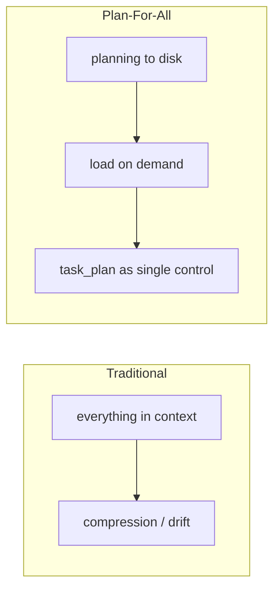
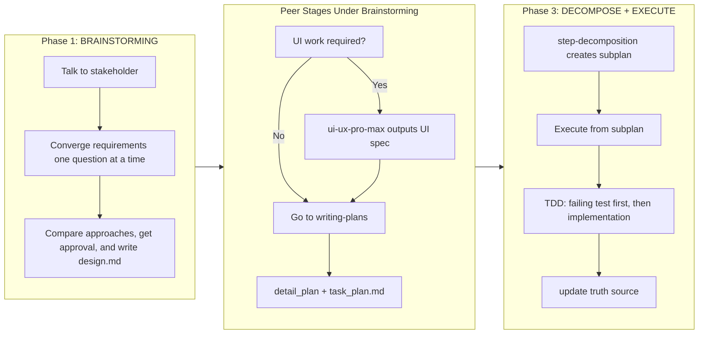

<div align="center">

# Plan-For-All

*Persist memory to disk like Manus, execute in small steps like TDD.*

[](https://claude.com/claude-code)
[](LICENSE)
[](https://github.com/obra/superpowers)
[](https://github.com/OthmanAdi/planning-with-files)
[](https://github.com/nextlevelbuilder/ui-ux-pro-max-skill)

> **Claude-Code-Agent-Plugin** | **superpowers (TDD & PM)** | **planning-with-files (Manus Style)** | **ui-ux-pro-max (Frontend Design)** | **MIT License**

</div>

---

<div align="center">

**🌐 Language / 语言**

[English](README_en.md) | [简体中文](README.md)

</div>

---

## Pain Points

Have you experienced these failure modes?

| Scenario | Result |
|----------|--------|
| Claude Code Plan Mode context gets compressed | Carefully collected requirements disappear and ToDos lose coherence |
| brainstorming + writing-plans output a giant plan blob | scope, state, and verification get mixed together until nothing is trustworthy |
| Long task interrupted mid-session | when you return, you no longer know what was active |
| UI, logic, storage, and protocol concerns get mixed together | without a single convergence owner, the request drifts before implementation even starts |

**Plan-For-All** is not about writing more documents. It separates requirement convergence, UI refinement, technical planning, decomposition, and test-driven execution into orchestrated disk-backed artifacts:
- `brainstorming` supervises whole-request convergence and final design contract
- `ui-ux-pro-max` and `writing-plans` are peer stages under `brainstorming` orchestration (UI first when UI work exists)
- `step-decomposition` builds execution views
- `test-driven-development` enforces test-first execution
- `task_plan.md` owns the single source of truth for status

---

## Core Philosophy

Plan-For-All breaks large work into resumable planning artifacts, uses `task_plan.md` as the control surface, and keeps active context focused on the current step.



---

## Workflow (Agent Orchestration)



---

## Current Principles

| Principle | Meaning |
|-----------|---------|
| `task_plan.md` is the only status truth source | `findings.md` and `progress.md` must not compete for status authority |
| Converge before plan | `brainstorming` plays the customer-facing product role: ask one question at a time, compare approaches, converge the whole request, and only then write the spec |
| `brainstorming` owns the whole request | integrated local projects should be reasoned about as one project unless the problem truly demands separation |
| `ui-ux-pro-max` and `writing-plans` are peer stages | both are orchestrated by `brainstorming`; if UI exists, run UI refinement before writing-plans |
| `writing-plans` is implementation handoff | it serves implementers and includes UI constraints from the UI stage when present |
| Smoke check before implementation | non-trivial work starts from a baseline proof or failure reproduction |
| TDD must not be postponed | no more “implement first, remind later” workflow |
| `step_subplan` is an execution view | it preserves a verbatim copy of the active phase from the detail plan for execution |
| Hook fallback guardrails stay | hooks continue to handle session recovery, context replay, and TDD/verification reminders without replacing the written workflow contract |
| New terms default to mandatory verification | new terms, semantically drifted terms, and recent paradigms must be checked first; if they would affect the next question, approach comparison, or design assumption, verify before asking, with official sources preferred and recent high-quality sources used when no official source exists |
| Audit stays active across phases | brainstorming, planning, decomposition, execution, and completion must all register new risky terms and carry blockers forward |

---

## Where `ui-ux-pro-max` Fits

`ui-ux-pro-max` and `writing-plans` are peer stages under `brainstorming` supervision.

`ui-ux-pro-max` does not own requirement convergence, but it must run before `writing-plans` when UI requirements exist.

`brainstorming` may call it only when:
- the already-converged design includes a user-visible interface
- layout, information hierarchy, interaction quality, or visual quality materially affect success
- the stakeholder explicitly wants stronger design direction, component design, visual quality, or a design system

`ui-ux-pro-max` is for:
- refining page structure
- refining information hierarchy
- refining interaction and visual direction
- surfacing UI risks and anti-patterns

It is not for:
- replacing whole-request convergence
- deciding the full functional scope of the product
- deciding whether the system should be split into frontend/backend
- owning the final design doc

After it runs, its outputs are merged into planning inputs before `writing-plans` begins.

When UI refinement runs, it must persist:
- `docs/plan-for-all/specs/YYYY-MM-DD-<topic>-ui-spec.md`

---

## Usage Examples

### Example 1: Todo Web With Login

**Input:**

```text
I want a todo website with login functionality.
```

**What happens automatically:**

```text
[plan-for-all] New project detected, entering Phase 1: BRAINSTORMING
```

```text
Q1: Is this todo website for yourself or for others?
  A: Personal use / B: Team collaboration / C: Public access
```

`brainstorming` then continues converging:
- goals
- non-goals
- workflows
- pages/modules
- feature boundaries
- constraints and acceptance criteria

Only after the overall request is understood may `brainstorming` call `ui-ux-pro-max` to refine interface details such as:
- information hierarchy
- page structure
- interaction model
- design direction
- UI risks and anti-patterns

Then `brainstorming` merges UI outputs into planning inputs and hands off to `writing-plans`.

### Example 2: API Proxy / Middleware Service

**Input:**

```text
Help me plan a local API proxy that routes multiple providers behind one entry point.
```

**What happens automatically:**

```text
Phase 1: AI first verifies high-risk external facts such as protocol and compatibility claims
     -> then converges protocol boundaries, config contracts, and acceptance criteria
     -> writes the design contract
```

Because this is backend / protocol work:

```text
Skip ui-ux-pro-max
Go directly to Phase 2: WRITING PLANS
```

### Example 3: Integrated Local Project

**Input:**

```text
I want a local knowledge-base tool with search, tags, note editing, and local storage.
```

**What happens automatically:**

```text
Phase 1: AI converges workflows, UI needs, storage choices, search behavior, editing behavior, and local boundaries together
     -> does not force an artificial frontend/backend split
```

If interface refinement is needed later, `brainstorming` may call `ui-ux-pro-max` as a support step. Otherwise it writes the design doc directly and moves to `writing-plans`.

---

## File Overview

| File | Purpose |
|------|---------|
| `docs/plan-for-all/task_plan.md` | master view and only status truth source |
| `docs/plan-for-all/specs/YYYY-MM-DD-<topic>-ui-spec.md` | UI spec contract for structure, component states, visual direction, and accessibility constraints |
| `docs/plan-for-all/plans/step_subplans/step_subplan_phaseN.md` | execution view for the current phase |
| `docs/plan-for-all/plans/YYYY-MM-DD-<topic>-detail.md` | full implementation plan |
| `docs/plan-for-all/findings.md` | decisions, assumptions, risks, audit output |
| `docs/plan-for-all/progress.md` | factual progress log, not a status owner |

---

## What Was Corrected

Compared with the legacy version, the current version explicitly fixes several systemic problems:

- it no longer treats hooks as the only mechanism; they remain as fallback guardrails for session recovery and TDD/verification reminders
- new terms, semantically drifted terms, and recent paradigms now enter mandatory verification instead of relying on stale model memory
- audit is no longer a one-time planning precheck; it now stays active through brainstorming, planning, decomposition, execution, and completion
- `brainstorming` is back to being the customer-facing convergence owner
- `ui-ux-pro-max` is upgraded to a peer stage orchestrated by `brainstorming` (UI first when UI is required)
- `writing-plans` is back to being the implementation handoff layer
- it no longer lets `progress.md` or `findings.md` own status
- it explicitly requires `step_subplan` to be a verbatim copy of the selected detail-plan phase
- it no longer defaults to stuffing speculative implementation code into the plan

See:
`systemic-legacy-skill-findings-and-remediation.md`

---

## Installation & Usage

This project is now both a Claude Code plugin with an agent entrypoint and a single-plugin marketplace source.

### Option 1: local plugin development load

From the parent directory of this repository:

```bash
claude --plugin-dir ./plan-for-all
```

Or from the repository root:

```bash
claude --plugin-dir .
```

After loading, run:

```bash
/reload-plugins
/agents
```

`plan-for-all` is set as default agent via `settings.json`.

### Option 2: local marketplace install test

Add this repository as a marketplace inside Claude Code:

```bash
/plugin marketplace add ./plan-for-all
/plugin install plan-for-all@plan-for-all-marketplace
```

After installation, run:

```bash
/reload-plugins
/agents
```

### Option 3: remote marketplace install

Current GitHub repository:

`https://github.com/mengsi16/plan-for-all`

Users can add this marketplace directly with:

```bash
claude plugin marketplace add mengsi16/plan-for-all
```

Then install the plugin with:

```bash
claude plugin install plan-for-all@plan-for-all-marketplace
```

Full remote installation flow:

```bash
claude plugin marketplace add mengsi16/plan-for-all
claude plugin install plan-for-all@plan-for-all-marketplace
```

---

## Core Rules

| Rule | Description |
|------|-------------|
| Plan first | never execute complex work without `docs/plan-for-all/task_plan.md` |
| Read before decisions | major decisions should read `task_plan.md` and `findings.md` first |
| Update after action | update `task_plan.md` first, then append to `progress.md` |
| Record assumptions and risks | keep them in `findings.md` |
| Three-failure protocol | diagnose -> alternate approach -> rethink -> ask user |

---

## Five-Question Recovery Test

At the start of each session, recover context with these five questions:

| Question | Answer Source |
|----------|---------------|
| Where am I? | current phase in `docs/plan-for-all/task_plan.md` + active subplan |
| Where am I going? | remaining phases in `docs/plan-for-all/task_plan.md` |
| What is the goal? | Goal declaration in `docs/plan-for-all/task_plan.md` |
| What have I learned? | `docs/plan-for-all/findings.md` |
| What do I do next? | current execution step in `step_subplan_*.md` |

---

## Acknowledgments

Plan-For-All was shaped by these open-source projects:

- **[superpowers](https://github.com/obra/superpowers)** — provided brainstorming, writing-plans, and TDD methodology
- **[planning-with-files](https://github.com/OthmanAdi/planning-with-files)** — provided the core idea of persisting plans to disk
- **[ui-ux-pro-max](https://github.com/nextlevelbuilder/ui-ux-pro-max-skill)** — provides interface-refinement support when a converged design needs dedicated UI work

Special thanks to the Manus idea for its core insight: **keep context for what matters, let disk hold the plan.**

---

## Hook Positioning

The current version explicitly keeps hooks with a narrow role:

- `UserPromptSubmit`: detect an active plan and remind the agent to read `task_plan.md`, `findings.md`, and `progress.md`
- `PreToolUse`: replay current status and execution context before reads or edits
- `PostToolUse`: remind the agent to sync plans and run TDD/verification after plan edits or file mutations
- `Stop`: remind the agent to leave `task_plan.md` and `progress.md` in a truthful state before the session ends

These hooks are fallback guardrails, not the primary source of discipline. The real workflow contract still lives in the design contract, detail plan, subplans, and execution steps.
