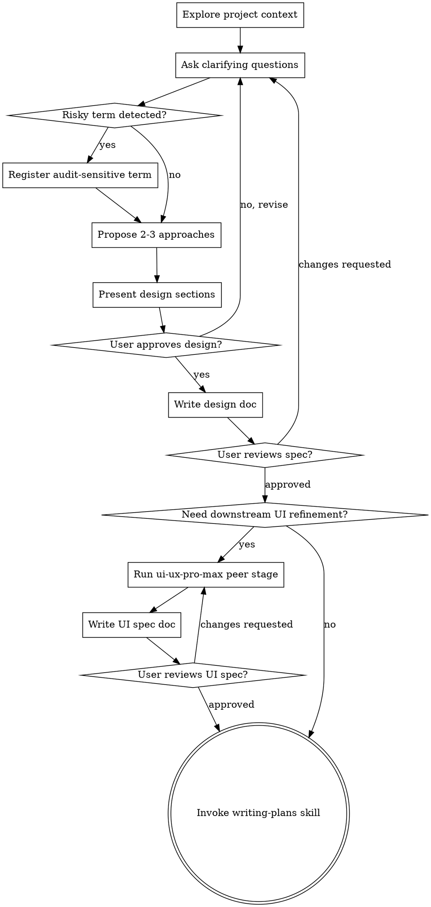

# Brainstorming Ideas Into Designs

Help turn ideas into an approved product/design specification through natural collaborative dialogue.

This skill is the customer-facing convergence layer. It plays the role that a strong product manager or solution designer would play when talking to a client or stakeholder: clarify what is actually needed, what is in scope, what success means, and what shape the solution should take before handing work to implementers.

Start by understanding the current project context, then ask questions one at a time to refine the request. Once the request is understood, present the design and get approval.

`ui-ux-pro-max` and `writing-plans` are peer downstream stages under `brainstorming` supervision. They do not replace this convergence step.

<HARD-GATE>
Do NOT invoke any implementation-oriented skill, write any code, scaffold any project, or take any implementation action until you have presented a design and the user has approved it.
</HARD-GATE>

## What This Skill Owns

`brainstorming` owns whole-task convergence for all of these kinds of work:
- backend-only work
- integrated local projects
- small monoliths that should not be artificially split
- UI-bearing products
- mixed UI + logic + storage projects
- partial subsystem changes that still need requirement clarification

Its job is to determine what the project needs as a whole, not to prematurely separate frontend and backend concerns unless the problem itself demands that separation.

## Required Output

The approved design document must contain:
- problem statement
- goals
- non-goals
- constraints
- users or operators when relevant
- major capabilities or workflows
- system shape and boundaries at the right level of detail
- acceptance criteria
- risks and open questions

If audit-sensitive terms or unstable external claims were discovered during brainstorming, the design doc must also list them so planning can treat them as mandatory audit inputs.

## Checklist

You MUST complete these in order:

1. **Explore project context** — inspect files, docs, and existing structure
2. **Ask clarifying questions** — one at a time, understand purpose, scope, constraints, workflows, and success criteria
3. **Register risky terms if needed** — capture high-risk terminology or unstable external claims without derailing convergence
4. **Propose 2-3 approaches** — with trade-offs and a recommendation
5. **Present design** — in sections scaled to complexity, get approval as you converge
6. **Decide whether UI refinement stage is needed** — if yes, route to `ui-ux-pro-max` first
7. **Write design doc** — save to `docs/plan-for-all/specs/YYYY-MM-DD-<topic>-design.md`
8. **User reviews written spec** — user can request changes before downstream stages start
9. **Run UI refinement stage when required** — invoke `skills/ui-ux-pro-max/SKILL.md` and write `docs/plan-for-all/specs/YYYY-MM-DD-<topic>-ui-spec.md`
10. **User reviews written UI spec** — user can request changes before downstream planning
11. **Transition to implementation planning** — invoke `skills/writing-plans/SKILL.md` after required UI refinement is complete

## Process Flow

## The Process

### Understanding The Request

- Check the current project state first: files, docs, existing patterns, and current boundaries.
- If the request is too large for a single design, help the user decompose it into smaller sub-projects.
- For appropriately scoped work, ask questions one at a time to refine the request.
- Focus on the real need, not just the first phrasing of the idea.

### What To Converge

Depending on the task, converge the relevant parts together:
- user workflows
- functional requirements
- page/screen requirements if applicable
- data/state/storage needs if applicable
- local vs remote boundaries if applicable
- interface/API boundaries if applicable
- operational constraints
- acceptance criteria

Do not force artificial frontend/backend separation onto tasks that are better reasoned about as a single integrated project.

### Requirement Convergence Rules

- Only one question per message.
- Do not dump a questionnaire.
- Do not jump from a vague idea straight to a static architecture write-up.
- Keep iterating until the request is specific enough that a design can be defended and later implemented.

### Audit Intake During Brainstorming

Audit is a support rule here, not the main workflow.

But it is still a blocking pre-question gate when unresolved external knowledge would distort the next step of convergence.

During brainstorming, if you notice:
- high-risk terminology
- semantically ambiguous terms
- recently evolving engineering paradigms
- unstable external claims that could change the design materially

then do this:
- note the term or claim
- capture the provisional task meaning if the user has made it clear
- mark it as audit-sensitive for planning
- avoid pretending it has already been verified

If the unresolved term or claim would change:
- the next clarifying question
- the framing of multiple-choice options
- the 2-3 approaches you are about to compare
- the protocol/provider/framework assumptions in the design

then pause and immediately invoke `skills/tech-knowledge-audit/SKILL.md` before continuing.

Use the audit result to narrow the factual landscape first, then resume normal requirement convergence.

Ask the user only for:
- project-specific intent
- private terminology
- preference or business choice
- ambiguity that authoritative sources cannot resolve

Do not ask the user to settle public technical facts that official docs, specs, release notes, official blogs, or recent authoritative ecosystem sources can verify.

Do not let audit intake replace normal requirement convergence.

### Exploring Approaches

- Propose 2-3 different approaches with trade-offs.
- Lead with your recommendation and explain why.
- For each approach, say when it is appropriate and what it costs.
- If an approach depends on unresolved external knowledge, say so explicitly.

### Presenting The Design

- Once you understand what is being built, present the design.
- Scale each section to complexity.
- Cover the parts that matter for this task: workflows, capabilities, boundaries, failure handling, testing expectations, and implementation constraints where relevant.
- Ask for confirmation or correction as you converge.
- Be ready to go back and clarify if something does not make sense.

### Downstream Support Skills

After the overall request has been converged at the customer/product level, orchestrate peer downstream stages in order.

#### `ui-ux-pro-max`
Use when the converged design includes a user-visible interface whose structure, information hierarchy, interaction quality, or visual quality needs dedicated refinement.

This skill does NOT own product requirement convergence. It is a peer downstream stage coordinated by `brainstorming` and must run before `writing-plans` when UI requirements exist.

When used, it must write `docs/plan-for-all/specs/YYYY-MM-DD-<topic>-ui-spec.md` (prefer `templates/ui_refinement_spec.md`) so `writing-plans` can consume stable UI constraints instead of chat-only notes.

#### `writing-plans`
Use only after the written design has been accepted, and after UI refinement if UI refinement is required.

This skill is for turning the approved design into implementation steps for people or agents who will write code.

## User Review Gate

After writing the design doc, the user must be able to review it before implementation planning starts.

If they request changes:
- revise the design
- keep requirement convergence active
- update the written spec

Only proceed to `writing-plans` after the written design is accepted.

## Key Principles

- **Customer-facing convergence first**
- **One question at a time**
- **Whole-task reasoning before implementation decomposition**
- **Explore alternatives**
- **Incremental validation**
- **Hard gate before implementation planning**
- **Audit intake is additive, not dominant**

## Anti-Patterns

Do not do these:
- jump straight to implementation files or code sketches
- replace requirement convergence with a static design template
- ask multiple unrelated questions in one message
- skip 2-3 approaches
- skip user approval and pretend the design is accepted
- let audit intake swallow the brainstorming workflow
- let `ui-ux-pro-max` replace product requirement convergence
- force frontend/backend separation onto integrated tasks without reason

## Handoff

After the user accepts the written design:
- if UI refinement is required, invoke `skills/ui-ux-pro-max/SKILL.md` first and write `docs/plan-for-all/specs/YYYY-MM-DD-<topic>-ui-spec.md`
- then invoke `skills/writing-plans/SKILL.md`

If audit-sensitive terms were found, ensure the design doc names them so planning treats them as mandatory audit inputs instead of hidden assumptions.
